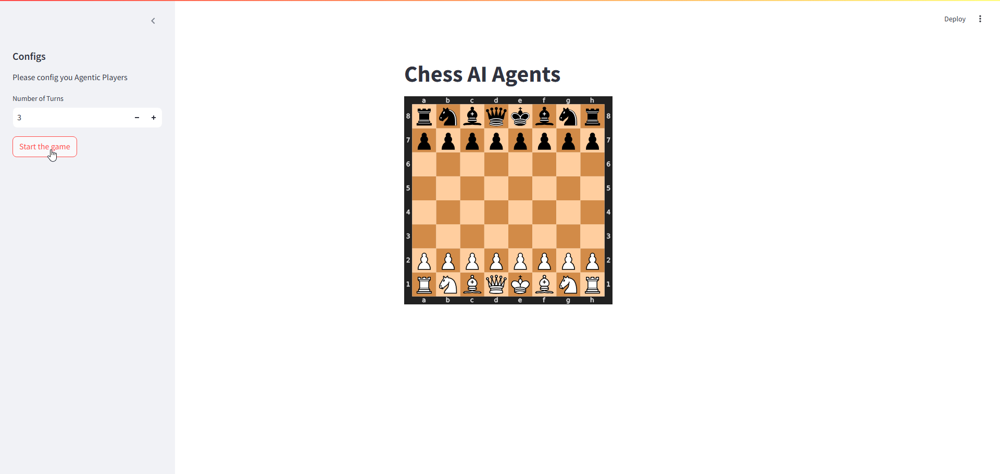

# Chess Playing Agents

Multi-agents playing a chess game using [AG2](https://docs.ag2.ai/docs/Home) (Autogen formally), Streamlit and ChatGPT.



You can try the live version:
[https://chess-agents.streamlit.app/](https://chess-agents.streamlit.app/)

## Installation

To run this project locally, follow these steps:

1. Clone the repository:
   ```sh
   git clone https://github.com/moaaztaha/Chess-Agents
   cd chess-playing-agents
   ```
2. Install the required packages:

   ```sh
   pip install -r requirements.txt
   ```

## Usage

To start the application, run:

```sh
streamlit run app.py
```
